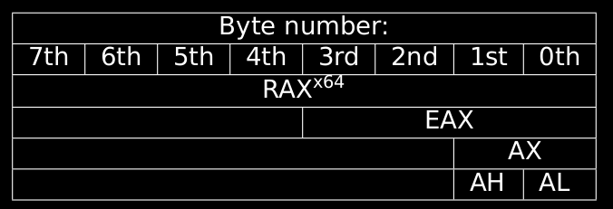
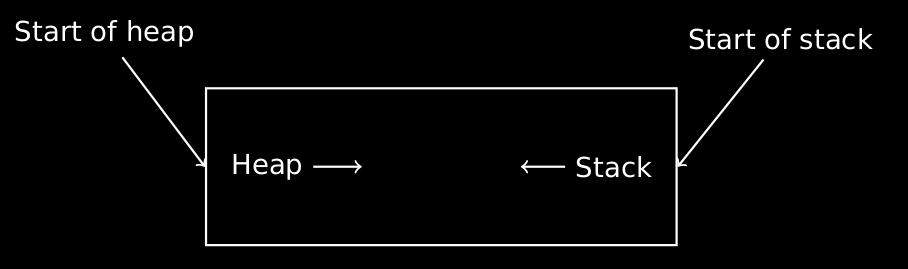

# Architectures

Different architectures have different syntax and number and size of registers. Some of the common archs are:
- x86
- x86-64
- ARM

In x86-64, all registers were extended to 64-bit, and now their names have an R-prefix. It is still possible to access the
32-bit parts, using the E- prefix. This is how the RAX/EAX/AX/AL register looks like in x86-64:

Architectures can be broadly classified into two categories:

### RISC (Reduced Instruction Set Computing)

Where number of instruction is less(optimised) but there is a large set of registers used. ARM comes under RISC

### CISC (Complex Instruction Set Computing)

Here there are many complex instructions but lesser number of registers. x86 comes under CISC

> This is a very basi diff, there are many more fundamental diffs b/w them

The core difference between those in this aspect is that ARM instructions operate only on registers with a few instructions for loading and saving data from / to memory while x86 can operate directly on memory as well.

Now, let's get back to a fundamental understanding of `Memory Stack`

- Stack uses LIFO method of operation. 
- The most commonly used instruction in stack is PUSH and POP. 
- PUSH subtracts from ESP/RSP/SP 4 in 32-bit mode (or 8 in 64-bit mode) and then writes the contents of its sole operand to  the memory address pointed by ESP/RSP/SP.
- POP does the opposite. retrieve the data from the memory location that RSP/ESP/SP points to, load it into the instruction operand (often a register) and then add 4 (or 8) to the stack pointer.

In simple terms PUSH decreases the stack pointer and POP increases it.
Also another strange thing about stack is that the bottom of the stack is at a lower memory address while the top is at a higher memory address. The bottom of the stack is actually at the beginning of the memory allocated for the stack block. It seems strange, but that’s the way it is.

### But why?

Acha have you ever used the same notebook for two subjects. What is the best way to divide? Starting writing for one subject from the begining and for the other from the back. That way, you can be sure that space is used effectively, but yeah there is a chance they might meet if they run out of space. 

This was the same idea that was kept in mind while making them. They programmer's had to fit both `heap` and `stack` but they couldn't estimate how much they should allocate to each, cause that will depend on the code. We haven't discussed about heap yet, we might later. Heap is basically the memory available for dynamic allocation of memory. So to avoid that they chose one end of the memory for heap and the other end for stack. 

When you make a function call, `CALL` instruction basically stores the current address in the stack. (`PUSH`-es it ) and makes a `JMP` to the function address. While `RET`-ing it fetches that stored address and `JMP` to that. Now this is a very important point, cause this is the very basic idea behind **Buffer Overflow** the fact that these `JMP` are unconditional allows us to make an exploit that changes the memory of the address stored in the stack that way we can make the program JMP to some other memory address of our choice. :)

Calling of functions depends on **calling conventions** used. 

Let's end our talk with a quite interesting function.`alloca()` function. It is worth noting the alloca() function 62 . This function works like malloc(), but allocates memory directly on the stack. The allocated memory chunk does not have to be freed via a free() function call, since the function epilogue returns ESP back to its initial state and the allocated memory is just dropped. It is worth noting how alloca() is implemented. In simple terms, this function just shifts ESP downwards toward the stack bottom by the number of bytes you need, making ESP pointing to the allocated block.

